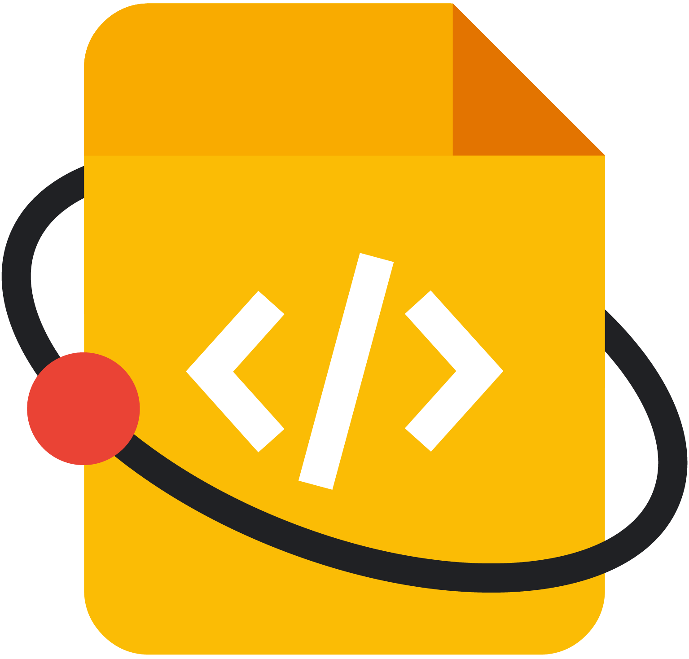

 

 

<h3>
 
Project Proposal
 
for
 
Reorganize docs for APISIX
 
Mentors: <a href="https://github.com/navendu-pottekkat">Navendu Pottekkat</a>
</h3>

 

# Table Of Contents

- [Table Of Contents](#table-of-contents)
- [**Abstract**](#abstract)
- [**Problem Statement**](#problem-statement)
- [**Project Details / Scope of this project**](#project-details--scope-of-this-project)
  - [Current status of the project](#current-status-of-the-project)
  - [Benefits to Community](#benefits-to-community)
- [**Schedule Of Deliverables**](#schedule-of-deliverables)
  - [Milestones](#milestones)
  - [Timeline](#timeline)
  - [Time Commitments](#time-commitments)
- [**General Notes**](#general-notes)
- [**About Me**](#about-me)
  - [Personal Information and Contact Details](#personal-information-and-contact-details)
  - [Why me?](#why-me)
  - [Past open source experience](#past-open-source-experience)
- [**Post GSoD Plans**](#post-gsod-plans)
- [_Special note for the reviewers_:](#special-note-for-the-reviewers)

 

# **Abstract**

This is the project proposal for _ Reorganization docs_ for APISIX on which I want to work as a part of Google Season of Docs 2023. I have proposed my timeline to complete this work in a span of 6 weeks.

Apache APISIX is a dynamic, real-time, high-performance API Gateway. APISIX API Gateway provides rich traffic management features such as load balancing, dynamic upstream, canary release, circuit breaking, authentication, observability, and more.

 

# **Problem Statement**

The initial idea of this project was building to re-organize APISIX docs to improve intuitive navigation.

But none has made any progress so far, existing proposals are either stale or incomplete due to lack of proper planning and organization of docs. 

It results in users being unable to find the relevant docs and using our communication forums more.

 

# **Project Details / Scope of this project**

1. To make the doc directory more intuitive by categorization, feedback and testing.
2. To measure use of the forum for doc related queries

I think more could be clarified in a short research phase with the mentor.

 

## Current status of the project

Confusing and hard to find relevant doc at time. 

 

## Benefits to Community

I think the main benefits of reordering the docs  would be that it would take less time to find relevant docs.

 

# **Schedule Of Deliverables** 

## Milestones 

The major milestones are: 

* Finding a way to categorize the docs for Apisix
* Making intuitive directory for docs
* Making the changes
* Testing and reiterating

 

## Timeline

Keeping these milestones in mind the following timeline will be followed. 

<table>
  <tr>
   <td>
<strong>Dates</strong>
   </td>
   <td><strong>Tasks</strong>
   </td>
  </tr>
  <tr>
   <td>
   </td>
   <td>Community Bonding Period Begins
   </td>
  </tr>
  <tr>
   <td>April 1 - April 15
   </td>
   <td>Identifying and finalizing the exact approach with mentors, setting up the project development environment, Preparing a draft infrastructure (Repos / Build / Test)
   </td>
  </tr>
  <tr>
   <td>
   </td>
   <td>Community Bonding Period Ends
   </td>
  </tr>
  <tr>
   <td>April 16 - 30
   </td>
   <td>Study the efficient approach, categorizing the docs, making intuitive navigation
   </td>
  </tr>
  <tr>
   <td>May 1 - May 15 
   </td>
   <td>Will work on reordering the docs as per plan
   </td>
  </tr>
  <tr>
   <td>May 16 - 30
   </td>
   <td>Testing with  the community and this period has been kept for completing remaining work (if any). If everything proceeds smoothly till this 

then this period will be utilized to solve other issues apart from this one.
   </td>
  </tr>
  <tr>
   <td>
   </td>
   <td>First Phase Completed
   </td>
  </tr>
  <tr>
   <td>June 1 - 15
   </td>
   <td>Finalize changes recommended by mentors and the community.
   </td>
  </tr>
  <tr>
   <td>June 16 - 30
   </td>
   <td>Reiterating over the docs if required.
   </td>
  </tr>
</table>

 

## Time Commitments 

* The above timeline is tentative and is for providing a rough idea of the planned project work. Full efforts will be made to stick to it. A much more detailed schedule will be shared with the mentors during the community bonding period after finalizing the exact approach for the project. 
* The expected time commitment for GSoD this time is 20 hours/week. I have no prior commitments during the coding period so will easily be able to contribute for the necessary time (even more if need be). 
* My college summer break starts on March 15 and classes resume on May 15 (tentative).
* At the time of writing this proposal, I am working as a Hyperledger Mentee under the Linux Foundation Mentorship Program which ends on March 10. This coincides **partially **with the community bonding period. However, this won’t be a problem at all since I will be free much before the actual GSoD period starts (June 13). Moreover, the majority of my mentorship work will be done by May 17 so I will be able to actively contribute during the community bonding period also.

 

# **General Notes**

I firmly believe that communication is one of the most important aspects of open source programs like GSoD. To make sure that the project status is communicated properly, I will be undertaking the following steps:

* Participating in Apache standups and community meetings.
* Publishing a bi-weekly blog post detailing the work done, problems faced, and how they were resolved.
* Maintaining a google doc with daily updates. Even if I’m stuck on some issue I will be writing that down in the doc. I believe this is a very effective way of not only maintaining accountability but also ensuring smooth asynchronous communication.
* Contacting the mentors daily to keep them in the loop of the progress of the project.
* I will be available to communicate via Slack, Discord, and any other communication medium available via Internet (Video Conference, Audio Conference, etc).

 

# **About Me**

## Personal Information and Contact Details

Name (public): Raj Gaurav Maurya

Preferred pronoun: he/him

E-mail address: [rajgm1722@gmail.com](mailto:rajgm1722@gmail.com)

Internet presence (e.g. blog, GitHub, Twitter, LinkedIn links) (blog will be displayed publicly): 

- Github: [@rajgm](https://github.com/rajgm)
- LinkedIn: [linkedin.com/in/rajgm29/](https://www.linkedin.com/in/rajgm29/)
- Hashnode: [https://hashnode.com/@rajgm](https://hashnode.com/@rajgm)
- Twitter: [twitter.com/RajGM_Hacks](https://twitter.com/RajGM_Hacks)
- GSoD Tracker: [https://github.com/RajGM/GSoC_OrganizationsTracker](https://github.com/RajGM/GSoC_OrganizationsTracker)
- Chat Application: [https://github.com/RajGM/SecureMessaging](https://github.com/RajGM/SecureMessaging)

Timezone: GMT +05:30 (IST - Indian Standard Timezone)

Location (city, state/province, and country) (public):

- City: Banglore 
- State: Karnataka 
- Country: India 

Education completed or in progress (include university, major/concentration, degree level, and graduation year):

- University: University of London 
- Degree: Bachelor of Science 
- Major: Computer Science
- Graduation Year: September 2023

 

## Why me?

I am Raj Gaurav, a senior at the University of London, a software engineer with proven expertise in full-stack web and mobile development through projects and internships.

So far, I have interned at DPS Munich, MLH at Solana Labs, and LFX at Hyperledger, and currently working as Product Manager and Software Engineer at GGI.

As a self-taught engineer, I always volunteer at coding boot camps, hackathons, and open-source projects.

Currently, I am mentoring at HackYourFuture and The Collab Lab.

 

## Past open source experience

I would like to share that I am a part of the Hyperledger organization.

Links: 

[orgs/LFX/Hyperledger/chia-connector](https://mentorship.lfx.linuxfoundation.org/project/fd61c1c4-1245-4f46-a942-d837333bcaaf)

[DraftPR for Cactus](https://github.com/RajGM/cactus/commit/04748bf54471a953602a3d365fbafc3fbdd91b51)

Over the semester, I improved myself with strategies on how to do multiple things at a time. As a result, I aced my capabilities. Working with various communities is what I'm most proud of. It taught me the importance of building a network and networking with folks.

This opportunity would also let me dive deeper into following good practices to write code and taking suggestions from communities via issues and incorporating them. Hence, I am applying with full enthusiasm for the same.

 

# **Post GSoD Plans**

I’m **not** applying for GSoD under any other organization this year since I am looking to learn in depth about Apache APISIX and use it my side project.

Post the GSoD period I would love to continue contributing by improving the documentation not only to the opened issues but by creating new one as required.

Once the project is completed, I’ll try to provide mentorship, improve on boarding experience and bug fixes for it since I want to contribute to the project in some or another way. Apart from that, I’ll always be a part of the Apache community and will be following as well as contributing towards its development and documentation.

 

# _Special note for the reviewers_: 

I am flexible enough if the mentor/maintainer/organizer thinks to change anything from above as per the requirements. I have just divided the work into 90 days to make clear how to work efficiently these days. This process will surely lead to working closely with the mentors.

Additionally, I would like to add that as I am a total newbie, I am still having many doubts about implementation but I am sure enough that with the help of mentors, I will be able to perform the task assigned. Just to let you know, support while coding is highly appreciated!

I am an open-source enthusiast and would highly like to contribute further to the project/work assigned to me after the primary task has been implemented.

I would also additionally love to explore the core inner workings of the project and try to contribute to the same after the primary task has been implemented.
